## FLASK API PROJECT DOCUMENTATION
---
An API (Application Programming Interface) is a set of rules and tools that allow different software programs to communicate with each other. It acts like a messenger, taking requests from one system (like a mobile app or website), fetching the necessary data or action from another system (like a server), and then returning the response in a way the first system can use. Essentially, it lets two different systems work together without knowing the internal details of each other.

An API, or Application Programming Interface, is like a bridge that allows different software programs to talk to each other and work together. Think of it as a waiter in a restaurant—an API takes your request (your order), tells the kitchen (the system) what you want, and then brings the response (your food) back to you.

Let’s break it down further with a simple analogy:

Imagine a Restaurant Scenario
The Restaurant: This represents a software system, like an app or a website.
The Menu: This is the list of things you can request from the system, similar to how you have a set of options (like getting data, posting data, updating information, etc.).
The Waiter (API): The waiter is the messenger between you (the client) and the kitchen (the system). You don’t go into the kitchen yourself; you simply tell the waiter what you want, and they take care of the rest.
In this analogy:

You (the client) make a request for something specific (like "I want a burger").
The waiter (API) takes your order, goes to the kitchen (the server), and tells the chef exactly what you need.
The kitchen (server) prepares the food (the data or service you want) and gives it to the waiter.
The waiter (API) brings the food back to you in a form you understand and enjoy (like a nicely prepared dish instead of raw ingredients).

So, What Exactly Does an API Do?
APIs are used whenever different parts of software need to work together without exposing all the details of how they work internally. For example:

When you use an app on your phone to check the weather, your phone’s app sends a request to a weather service API. The API then fetches the current weather data from the server and sends it back in a way your app can display (like a sunny icon with the temperature).
When you log in to a website using your Google or Facebook account, the website uses an API provided by Google or Facebook to authenticate you. The API handles the exchange of information safely and securely without you needing to know how it all works behind the scenes.
Why Do We Use APIs?
Efficiency: APIs allow different systems to interact smoothly, saving time and resources. Developers don’t have to build everything from scratch—they can connect to existing services instead.
Security: APIs provide a controlled way to access systems. For instance, when you log in with your Google account, the API only shares necessary information and not your whole Google profile.
Consistency: APIs deliver data in a consistent format so different applications (apps, websites, etc.) can understand and use it without confusion.
A Simple Example: Using an API in a Weather App
You open a weather app on your phone and want to know today’s weather in your city.
The app (client) sends a request to the weather service’s API: "What’s the weather like today in [your city]?"
The weather service (server) processes this request and sends back a response through the API: "It’s sunny, and the temperature is 25°C."
The API formats this response in a way the app can display, so you see the sunny icon and the temperature.
In short, an API is a helpful "middleman" that lets software systems communicate with each other in a structured, secure, and efficient way. It makes life easier for developers and users by simplifying complex interactions between different software components or systems.

### WHY IS API IMPORTANT
APIs are crucial in today’s digital world for several reasons:
 ### Interoperability
APIs allow different systems, apps, and platforms to connect and exchange data, even if they are built using different technologies. This interoperability is crucial for integrating services and creating seamless user experiences.

### Efficiency and Reusability
APIs let developers access and use existing services or data without building everything from scratch. This saves time and resources, allowing for quicker development and deployment of applications. Developers can build on top of existing APIs to add functionality without reinventing the wheel.

### Scalability
APIs make it easy to expand functionality over time. For example, as a business grows, it can offer more services through its API or connect with other systems to provide enhanced features, all without disrupting the existing setup.

### Security and Control
APIs provide a secure way to access data and services by acting as a gateway. They allow systems to share only necessary information and implement authentication and authorization, ensuring that data is accessed in a controlled and secure manner.

### Automation
APIs enable automation by allowing software systems to interact with each other without manual intervention. This can automate repetitive tasks, integrate business processes, and improve overall efficiency.

### Innovation and Integration
APIs are the backbone of modern applications and services. They allow businesses to integrate with third-party services, such as payment gateways, social media platforms, and cloud services, fostering innovation and enabling companies to offer more comprehensive solutions.

---

### How Do APIs Work?
APIs (Application Programming Interfaces) enable communication between different software applications. Here's a basic breakdown of how they function:

Basic Components of an API
- Request: The client (e.g., a web browser or mobile app) sends a request to the server through the API. This request contains several elements:

- Endpoint: The URL where the API is accessed (e.g., /api/users).
- Method: The action to be performed, typically using standard HTTP methods such as:
- GET: Retrieve data.
- POST: Submit new data.
- PUT: Update existing data.
- DELETE: Remove data.
- Headers: Extra information like authentication tokens or content type (Authorization: Bearer <token>, Content-Type: application/json).
- Body: The actual data being sent, usually for POST or PUT methods. It's often formatted as JSON or XML.
Response: Once the server processes the request, it sends a response back to the client. The response usually contains:

- Status Code: This indicates the outcome of the request (e.g., 200 OK for success, 404 Not Found for missing resources, or 500 Internal Server Error for server issues).
- Headers: Additional metadata about the response (e.g., Content-Type: application/json).
- Body: The returned data from the server, typically in JSON format.

Types of APIs
REST (Representational State Transfer):
Most Common: REST APIs are widely used and operate through standard HTTP methods (GET, POST, PUT, DELETE).
Stateless: Each request contains all the necessary information, and the server doesn’t retain the client's state between requests.

SOAP (Simple Object Access Protocol):
Older Protocol: Uses XML format for exchanging data and can be more complex than REST.
Highly Secure: SOAP is often used in enterprise applications where security, transactions, and compliance are critical.

GraphQL:
Newer Query Language: Clients can request only the data they need, making it more flexible.
Efficiency: It reduces data transfer by allowing more specific queries than REST.
Key Benefits of APIs
Efficiency: APIs automate processes, reducing manual intervention and speeding up workflows.
Innovation: Developers can easily access and integrate new technologies and services, enabling rapid innovation.
Collaboration: APIs allow teams to work on different parts of a system independently, improving productivity and fostering innovation

### Setting Up the Project
To set up the project directory structure and create a virtual environment, follow these steps using the terminal in VS Code, either with Git Bash or PowerShell:

### Open the Terminal in VS Code
Windows Users: Press the shortcut "Ctrl + ` " (backtick key).

Mac Users: Press the shortcut "Cmd + ` " (backtick key).

Alternatively, you can open the terminal by navigating to the top menu, selecting Terminal, and then choosing New Terminal from the dropdown options.

### Use Bash for This Project
- start up your bash from the terminal.
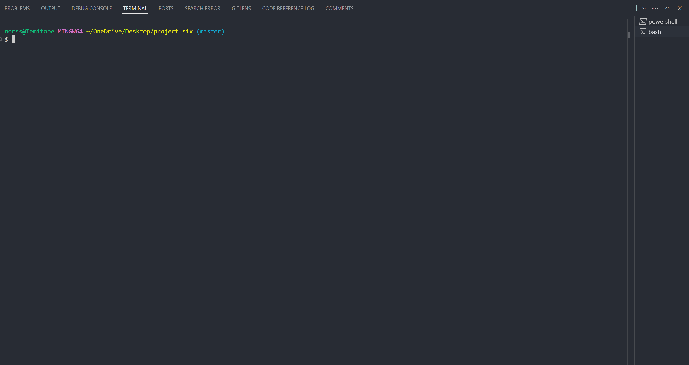

```bash
mkdir -p flask_api_project/{templates,static} && touch flask_api_project/app.py flask_api_project/templates/index.html flask_api_project/static/style.css && python -m venv flask_api_project/venv
```

This command will:
- Create the project directory flask_api_project with subdirectories templates and static.
- Create empty files: app.py, index.html inside the templates folder, and style.css in the static folder.
- Set up a virtual environment in the venv folder within the flask_api_project directory.

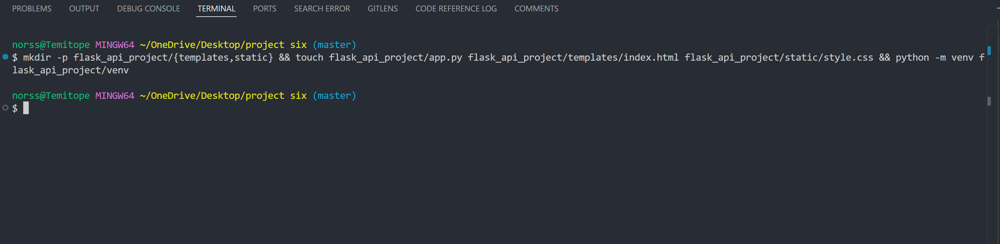

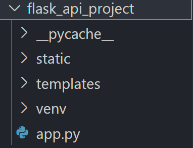

The command above will create the project enviroment

1. **In the `app.py`** file paste the code below
    ```python
    from flask import Flask, request, jsonify, render_template

    app = Flask(__name__)

    users = []

    @app.route('/')
    def home():
        return render_template('index.html')

    @app.route('/users', methods=['POST'])
    def create_user():
        user = request.get_json()
        users.append(user)
        return jsonify(user), 201

    @app.route('/users', methods=['GET'])
    def get_users():
        return jsonify(users), 200

    @app.route('/users/<int:user_id>', methods=['GET'])
    def get_user(user_id):
        user = next((u for u in users if u['id'] == user_id), None)
        return jsonify(user), 200 if user else 404

    @app.route('/users/<int:user_id>', methods=['PUT'])
    def update_user(user_id):
        user = request.get_json()
        index = next((i for i, u in enumerate(users) if u['id'] == user_id), None)
        if index is not None:
            users[index] = user
            return jsonify(user), 200
        return '', 404

    @app.route('/users/<int:user_id>', methods=['DELETE'])
    def delete_user(user_id):
        global users
        users = [u for u in users if u['id'] != user_id]
        return '', 204

    if __name__ == '__main__':
        app.run(debug=True)
    ```


 **In the `index.html`** in the `templates` directory paste the code below:


 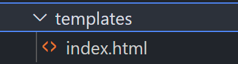


    ```html
    <!DOCTYPE html>
    <html lang="en">
    <head>
        <meta charset="UTF-8">
        <meta name="viewport" content="width=device-width, initial-scale=1.0">
        <title>API-Based Application</title>
        <link rel="stylesheet" href="{{ url_for('static', filename='style.css') }}">
    </head>
    <body>
        <h1>User Management</h1>
        <form id="userForm">
            <input type="text" id="name" placeholder="Name" required>
            <input type="email" id="email" placeholder="Email" required>
            <button type="submit">Add User</button>
        </form>
        <ul id="userList"></ul>

        <script>
            document.getElementById('userForm').addEventListener('submit', async function (event) {
                event.preventDefault();
                const name = document.getElementById('name').value;
                const email = document.getElementById('email').value;
                
                const response = await fetch('/users', {
                    method: 'POST',
                    headers: {
                        'Content-Type': 'application/json'
                    },
                    body: JSON.stringify({ name, email })
                });

                const user = await response.json();
                document.getElementById('userList').innerHTML += `<li>${user.name} (${user.email})</li>`;
            });
        </script>
    </body>
    </html>
    ```

  **In the `style.css`** in the `static` directory paste this code below there:

  

 
    ```css
    body {
        font-family: Arial, sans-serif;
        margin: 20px;
    }

    form {
        margin-bottom: 20px;
    }

    input {
        margin-right: 10px;
    }
    ```

### Step 3: Running the Application

## Window Users
```bash
python -m venv venv
source venv/Scripts/activate
pip install Flask
```

## Mac Users
```bash
source venv/bin/activate  
pip install Flask       
```
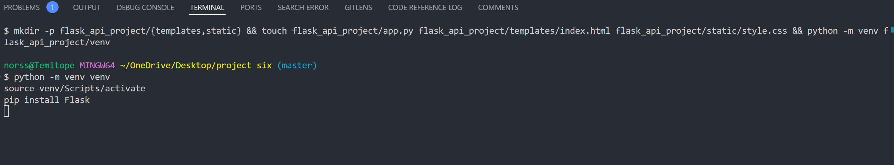


Run your Flask application:
```bash
flask run
```
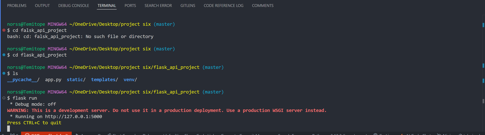

Open your browser and go to `http://127.0.0.1:5000` to see your application.

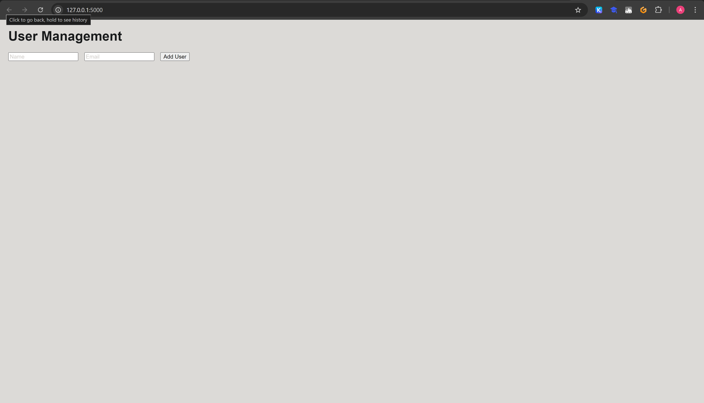

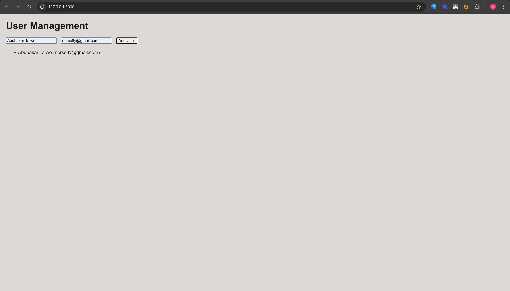

### Testing the API

What is Postman?

Postman is a powerful tool that helps developers test, develop, and share APIs. It provides a user-friendly interface where you can easily send HTTP requests, view responses, and manage API environments. Postman simplifies the process of testing APIs without needing to write code, making it essential for developers and testers working with APIs.

### How to Use Postman for API Testing:

Install Postman: If you don’t have Postman installed, download and install it using one of the following:

Windows: (https://dl.pstmn.io/download/latest/win64)

Mac (Apple Silicon):
bash
Copy code
curl -o- "https://dl-cli.pstmn.io/install/osx_arm64.sh" | sh

Mac (Intel):
bash
Copy code
curl -o- "https://dl-cli.pstmn.io/install/osx_64.sh" | sh

Create a New Request:

- Open Postman and click on "New" to start a new request.


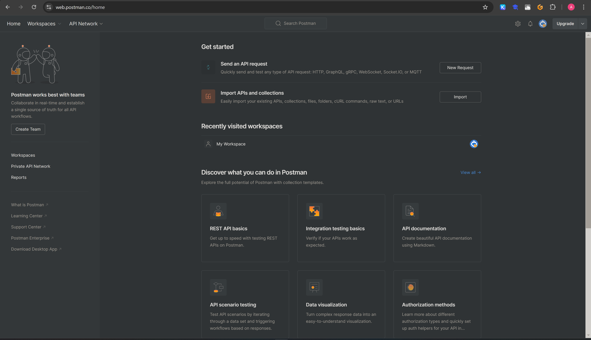

- Choose the HTTP method (GET, POST, PUT, DELETE) based on what you want to test.

- For this,We will be choosing POST

- Then Enter the API endpoint URL.

- For this, we will be using the endpoint we created earlier(http://127.0.0.1:5000/users)

- Then Enter the request body. For this, we will be using JSON format.

- For this, we will be using the following JSON body:

```json
        {
            "id": 1,
            "name": "your name",
            "email": "yourname@example.com"
        }
```

- Then click on the "Send" button to send the request.It would like this.

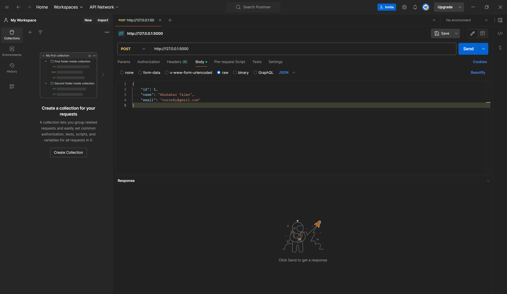

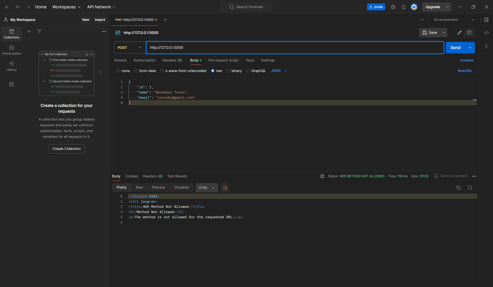

# HTTP Status Codes and their meaning:

- 200 OK: The request was successful (common for GET, PUT).
- 201 Created: A new resource was created (common for POST).
- 204 No Content: The resource was successfully deleted (common for DELETE).
- 404 Not Found: The requested resource was not found (if you try to GET, PUT, or DELETE a non-existing user)

